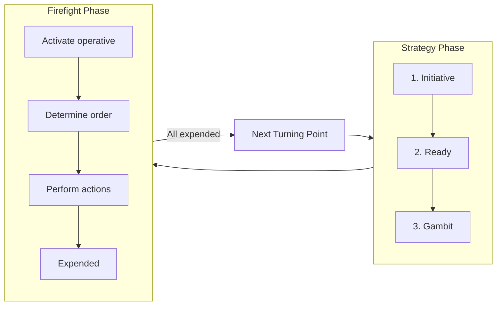

# Game Design Document

**Version:** 1.0  
**Audience:** Product, design, and development  

---

## 1. Introduction and scope

### 1.1 Goal

Deliver an **accessible web game** with deep tactical play, clear turn structure, and mission-driven victory. The game uses a server-authoritative architecture: randomness (dice, roll-offs), distances, visibility, and all rule-critical state are resolved by the game engine so that outcomes are fair and consistent.

### 1.2 Audience

- **Product:** Scope, features, and acceptance criteria.
- **Design:** UX flows, accessibility, and clarity of phase/sub-step.
- **Development:** Authoritative rules, data models, and validation points.

### 1.3 Core design

- **Turn structure:** Each game is divided into turning points. Each turning point has a Strategy phase followed by a Firefight phase.
- **Strategy phase order:** Initiative → Ready → Gambit (resolved in that order at the start of each turning point).
- **Firefight phase:** Alternating activations (initiative player first); Determine order → Perform actions → Expended; Counteract when one side has all operatives expended and the other has ready operatives.
- **Operatives and datacards:** APL, Move, Save, Wounds; weapon stats (Atk, Hit, Dmg) and weapon rules that modify attacks; keywords; orders (Engage / Conceal).
- **Action economy:** AP costs, APL limit, action restrictions (same action at most once per activation); minimum 0 AP per action.
- **Combat and damage:** Valid target, cover, obscured, control range, intervening; damage application; wounded / injured / incapacitated / removed.
- **Ploys and CP:** Gained in Ready; spent on ploys; Command Re-roll and kill team ploys; once per ploy per turning point unless specified.
- **Victory conditions:** Defined by mission packs (objectives, control, etc.).

### 1.4 Core systems

- **Randomness:** Dice rolls (D6, D3, roll-offs) are performed by the game server; results are sent to clients. Optional reveal animation for engagement.
- **Measuring:** Distances (inches) are computed by the engine from base-to-base or to markers; "within" and "wholly within" are enforced by the rules.
- **Visibility and terrain:** Line-of-sight, intervening, cover, and obscured are derived from the killzone and terrain model via geometric queries.
- **Tracking:** Ready/expended state, CP, wounds, and effect tokens are represented as game state; the UI reflects this state.
- **Simultaneous resolution:** When rules would happen at the same time, the initiative player decides order; the app implements this as a discrete sub-step (e.g. "Simultaneous resolution – initiative player chooses order").

---

## 2. Core systems overview

All randomness and rule-critical state changes **must be server-authoritative**. The client must not be able to alter dice results, distances, visibility, or damage. This ensures fairness and consistency.

| Game element | System behaviour |
|--------------|------------------|
| **Dice rolls (D6, D3, roll-offs)** | Server performs RNG; results sent to clients. Optional "reveal" animation for engagement. |
| **Measuring distances (inches)** | Engine computes distance (base-to-base or to markers). "Within" / "wholly within" as defined in the rules. |
| **Initiative roll-off** | Server resolves roll-off; winner (or tie rule) applied; UI shows result. |
| **Ready / expended state** | Operative state: `ready` / `expended`; UI reflects state (e.g. lighter/darker token equivalent). |
| **CP (Command points)** | Integer per player; spend only via allowed ploys; server validates; UI displays current CP. |
| **Visibility / intervening / cover / obscured** | Line-of-sight and terrain queries computed from killzone model; valid target and cover save derived from rules. |
| **Markers (objective, mission)** | Game objects with position and type; control/contest logic uses control range and APL totals. |
| **Effect tokens** | Effect flags or tags on operatives; duration tied to turning point or specified end condition. |
| **Probability display** | Pre-calculated expected hits, saves, and damage when a valid attack target is selected; informational only; optional/toggleable. |

---

## 3. Game loop and phases

### 3.1 High-level flow

Each turning point runs in this order:

1. **Strategy phase** (Initiative → Ready → Gambit).
2. **Firefight phase** (alternating activations until all operatives are expended, including Counteract).
3. **End of turning point** → repeat from step 1 until the mission end condition is met.



### 3.2 Strategy phase – order of resolution

Resolved **strictly in this order** at the start of each turning point.

#### 3.2.1 Initiative

- **First turning point:** Who has initiative is determined by the game sequence of the mission pack (e.g. set during setup or by mission rules).
- **Subsequent turning points:** Players roll off (one D6 per player). The winner decides who has initiative. If the roll-off is a tie, the player who **did not** have initiative in the previous turning point decides who has initiative (this overrides roll-off result). The server performs the roll-off; on tie, the app prompts the previous non-initiative player to choose and records the initiative holder. The initiative player decides the order of resolution for any rules that would happen at the same time (in the Strategy phase or elsewhere).

In some mission packs, initiative is also determined when setting up the battle; the player with initiative then decides the order of resolution for simultaneous rules that happen before the battle begins. The app must support a "before battle" resolution step where applicable, with initiative player choosing order.

#### 3.2.2 Ready

- Each player gains **1 Command point (CP)**. In each turning point after the first, the player who **does not** have initiative gains **2 CP** instead. CP are kept until spent.
- Each player readies all friendly operatives (set state to `ready`). The server applies CP and sets all operatives to `ready`.

#### 3.2.3 Gambit

- Starting with the player who has initiative, each player alternates either using a **STRATEGIC GAMBIT** or **passing**.
- Repeat until **both players have passed in succession**.
- Strategy ploys are the most common STRATEGIC GAMBIT; any rule labelled STRATEGIC GAMBIT can be used. Each STRATEGIC GAMBIT can be used **at most once per turning point**. The app alternates prompts (initiative first); the server enforces one use per STRATEGIC GAMBIT per TP and CP cost.

### 3.3 Firefight phase – order of resolution

- The player who has initiative **activates a ready friendly operative**. When that activation ends, the opponent activates one of their ready friendly operatives. Players alternate until all of one player's operatives are expended; that player may then **Counteract** between the opponent's remaining activations. When all operatives are expended, the Firefight phase ends.

**Per activation:**

1. **Determine order** – Select the operative's order (Engage or Conceal). It keeps this order until its next activation.
2. **Perform actions** – The operative performs actions (AP/APL and action restrictions apply). One action at a time; after each action the player decides the next.
3. **Expended** – When the activation ends, the operative is expended (state = `expended`).

**Counteract:**

- When you would activate a ready friendly operative, if **all your operatives are expended** but your opponent still has ready operatives, you may instead select an **expended** friendly operative with an **Engage** order to perform a **1 AP action for free** (excluding Guard). Each operative can only counteract **once per turning point**. While counteracting, the operative cannot move more than **2"**, or if removed and set up again must be set up **wholly within 2"** (takes precedence over other move rules). See §5.4.9.
- Counteracting is **optional**; in either case, activation alternates back to the opponent.
- Counteracting is **not** an activation (it is instead of activating). The server offers "Counteract with [operative]" or "Pass" when applicable and enforces once per operative per TP and the 2" limit.

### 3.4 Simultaneous rules

Whenever two or more rules would happen at the same time, the **player with initiative** decides the order of resolution. The app must implement this as an explicit sub-step: e.g. "Simultaneous resolution – initiative player chooses order" with a list of pending effects.

### 3.5 Action request flow (optional diagram)

```mermaid
sequenceDiagram
  participant Client
  participant Server
  Client->>Server: Request action (e.g. Shoot, target)
  Server->>Server: Validate (AP, order, valid target, etc.)
  alt Valid
    Server->>Server: Apply (dice, damage, state)
    Server->>Client: Broadcast new game state
  else Invalid
    Server->>Client: Reject; revert to pre-action state
  end
```

---

## 4. Operatives and datacards (data model)

### 4.1 Operative stats

- **APL (Action point limit):** Total AP the operative can spend during its activation; also used for marker control. Modified by rare rules; **total APL can never be more than +1 or -1 from its normal APL** (takes precedence over all stat changes).
- **Move:** Used for Reposition, Fall Back, and Charge. **Move can never be less than 4"** (takes precedence over all stat changes). If stats change during an action, apply the change when the action is completed.
- **Save:** Result required for successful defence dice when another operative is shooting this operative (higher number = worse).
- **Wounds:** Starting wounds; reduced by damage. When reduced to 0 or less, the operative is incapacitated and then removed from the killzone.

### 4.2 Weapon stats

- **Weapon type:** Ranged (shooting) or melee (fighting / retaliating).
- **Atk:** Number of attack dice when using this weapon.
- **Hit:** Result required for a successful attack die (e.g. 4+).
- **Dmg:** Two values – Normal Dmg (normal success) and Critical Dmg (critical success).
- Weapons with the same primary name but different secondary names in brackets (e.g. "plasma gun (standard)" and "plasma gun (supercharge)") are separate weapon profiles. Rules referring only to the primary name apply to all profiles with that primary name.

### 4.3 Weapon rules

Weapon rules apply whenever a **friendly operative** uses a weapon that has them. Common weapon rules are listed below; rare weapon rules may appear in kill team rules.

- **Duplicate rules:** A weapon gains no benefit from having the same weapon rule more than once, **unless** the weapon rule has an **x** (e.g. Accurate x), in which case select which x to use. If a weapon has **more than one instance of Accurate x**, treat it as **one instance of Accurate 2** instead (this takes precedence over the x rule above).
- **Order when multiple rules apply at once:** If a friendly operative is using a weapon that has multiple weapon rules that would take effect at the same time, the **attacker** (controlling player) can choose the order they take effect.

#### 4.3.1 Weapon rules reference

| Rule | Effect |
|------|--------|
| **Accurate X** | You can retain up to x attack dice as normal successes without rolling them. If a weapon has more than one instance of Accurate x, treat it as one instance of Accurate 2 instead. |
| **Balanced** | You can re-roll one of your attack dice. |
| **Blast X** | The target you select is the primary target. After shooting the primary target, shoot with this weapon against each secondary target in an order of your choice (roll each sequence separately). Secondary targets are other operatives visible to and within x of the primary target (e.g. Blast 2"); they are all valid targets, regardless of a Conceal order. Secondary targets are in cover and obscured if the primary target was. |
| **Brutal** | Your opponent can only block with critical successes. |
| **Ceaseless** | You can re-roll any of your attack dice results of one result (e.g. results of 2). |
| **Devastating X** | Each retained critical success immediately inflicts x damage on the operative this weapon is being used against. If the rule starts with a distance (e.g. 1" Devastating x), inflict x damage on that operative and each other operative visible to and within that distance of it. Success is not discarded after doing so—it can still be resolved later in the sequence. |
| **Heavy** | An operative cannot use this weapon in an activation or counteraction in which it moved, and it cannot move in an activation or counteraction in which it used this weapon. If the rule is Heavy (x only), where x is a move action, only that move is allowed (e.g. Heavy (Dash only)). This weapon rule has no effect on preventing the Guard action. |
| **Hot** | After an operative uses this weapon, roll one D6. If the result is less than the weapon's Hit stat, inflict damage on that operative equal to the result multiplied by two. If it's used multiple times in one action (e.g. Blast), still only roll one D6. |
| **Lethal X+** | Your successes equal to or greater than x are critical successes (e.g. Lethal 5+). |
| **Limited X** | After an operative uses this weapon a number of times in the battle equal to x, they no longer have it. If it's used multiple times in one action (e.g. Blast), treat this as one use. |
| **Piercing X** | The defender collects x less defence dice (e.g. Piercing 1). If the rule is **Piercing Crits x**, this only comes into effect if you retain any critical successes. |
| **Punishing** | If you retain any critical successes, you can retain one of your fails as a normal success instead of discarding it. |
| **Range X** | Only operatives within x of the active operative can be valid targets (e.g. Range 9"). |
| **Relentless** | You can re-roll any of your attack dice. |
| **Rending** | If you retain any critical successes, you can retain one of your normal successes as a critical success instead. |
| **Saturate** | The defender cannot retain cover saves. |
| **Seek** | When selecting a valid target, operatives cannot use terrain for cover. If the rule is **Seek Light**, operatives cannot use Light terrain for cover. This can allow such operatives to be targeted (if visible) but does not remove their cover save (if any). |
| **Severe** | If you don't retain any critical successes, you can change one of your normal successes to a critical success. The Devastating and Piercing Crits weapon rules still take effect, but Punishing and Rending don't. |
| **Shock** | The first time you strike with a critical success in each sequence, also discard one of your opponent's unresolved normal successes (or a critical success if there are none). |
| **Silent** | An operative can perform the Shoot action with this weapon while it has a Conceal order. |
| **Stun** | If you retain any critical successes, subtract 1 from the APL stat of the operative this weapon is being used against until the end of its next activation. |
| **Torrent X** | Select a valid target as normal as the primary target, then select any number of other valid targets within x of the first valid target as secondary targets (e.g. Torrent 2"). Shoot with this weapon against all of them in an order of your choice (roll each sequence separately). |

### 4.4 Orders

- **Engage:** Can perform actions as normal and can Counteract.
- **Conceal:** Cannot perform Shoot or Charge; cannot Counteract. While in cover, not a valid target.
- Operatives are given **Conceal** when set up before the battle. Order is changed only when the operative is activated (Determine order step).

### 4.5 Keywords and bases

- **Keywords** identify operatives for rules (e.g. faction keywords). Shown in keyword bold; faction keywords are distinct for identifying kill team.
- **Base size (mm)** is specified on the datacard. All distance measurement is from the base; bases cannot overlap or go off the killzone or through terrain.

### 4.6 Canonical operative/datacard schema

The following schema defines a single operative (datacard) for use in the application. Datacards in the app are instances of this structure.

```json
{
  "id": "string",
  "name": "string",
  "agentType": "string",
  "baseSizeMm": "number",
  "stats": {
    "apl": "number",
    "move": "number",
    "save": "number",
    "wounds": "number"
  },
  "weapons": [
    {
      "id": "string",
      "primaryName": "string",
      "secondaryName": "string | null",
      "type": "ranged | melee",
      "atk": "number",
      "hit": "number",
      "normalDmg": "number",
      "criticalDmg": "number",
      "weaponRules": [
        { "id": "string", "x": "number (optional)", "result": "number (optional)" }
      ]
    }
  ],
  "keywords": ["string"],
  "additionalRules": ["string"],
  "uniqueActions": ["string"]
}
```

Each **weaponRules** entry has **id** (e.g. `"balanced"`, `"lethal"`, `"blast"`) and, where the rule specifies, **x** (e.g. Blast 2, Lethal 5+, Range 9") or **result** (e.g. Ceaseless "results of 2").

**Runtime state** (per operative in a live game) is separate and includes: `order` (Engage | Conceal), `ready` (boolean), `currentWounds`, `counteractedThisTP` (boolean), `carriedMarkerId` (optional), and any effect tokens/duration.

---

## 5. Actions and action economy

### 5.1 Action economy rules

- Each action costs **AP**; total AP spent during an operative's activation cannot exceed its **APL**.
- An operative cannot perform the **same action more than once** during its activation (action restrictions).
- Regardless of AP modifiers, the **minimum AP cost for an action is always 0** (takes precedence over all AP changes).
- Actions are performed one at a time; the player decides the next action after seeing the result of the previous.
- If an action is declared or begun but **cannot be completed**, the action is **cancelled**. Revert to the game state before that action (e.g. return the operative to its prior position); the action is not performed and no AP is spent.

### 5.2 Action types and framework

Actions have **conditions** and **effects**. **Conditions** must be fulfilled for the operative to perform that action; **effects** are what happen when the operative performs the action, including any requirements when doing so.

There are four types of actions:

- **Universal actions** are the most common and can be performed by all operatives unless specified otherwise. The main universal actions are set out in §5.4.
- **Unique actions** appear in kill team rules. Only specified operatives can perform them.
- **Mission actions** are specific to the mission or killzone (mission pack, killzone rules, or selected equipment).
- **Free actions** can only be performed when another rule specifies. The following apply to free actions:
  - The conditions of the action must be met.
  - The action does not cost the operative any additional AP.
  - The operative still counts as performing the action for all other rules. For example, if it performed the action during its activation, it cannot perform that action again during that activation.

If an operative performs a free action **outside** their activation, that does not prevent them from performing that action during their activation, or vice versa.

### 5.3 Validation

The server validates after **each** action (AP spent, action restriction, legality of the action). If validation fails, the server rejects the action and reverts to the state before that action. No partial application of illegal actions.

### 5.4 Universal actions

| Action | AP cost | Notes |
|--------|---------|--------|
| Reposition | 1 | Move up to Move stat; straight-line increments, rounded up to nearest inch. |
| Dash | 1 | As Reposition but up to 3"; cannot climb; can drop and jump. |
| Fall Back | 2 | As Reposition but can move within enemy control range (cannot finish there). |
| Charge | 1 | As Reposition but +2" move; must finish within enemy control range; Conceal cannot perform. |
| Pick Up Marker | 1 | Remove a marker the operative controls (that the action can be performed upon); operative carries it. |
| Place Marker | 1 | Place a marker the operative is carrying within its control range. |
| Shoot | 1 | Ranged attack; follow Shoot sequence (§5.4.7). Conceal cannot perform. |
| Fight | 1 | Melee; follow Fight sequence (§5.4.8). Conceal cannot perform. |
| Counteract | 0 | Free 1 AP action when specified; see §5.4.9. |

#### 5.4.1 Reposition (1 AP)

- Move the active operative up to its **Move** stat to a location it can be placed. Movement must be done in **one or more straight-line increments**; increments are always **rounded up to the nearest inch**.
- The operative **cannot move within control range of an enemy operative**, unless one or more other friendly operatives are already within control range of that enemy operative—in which case it can move within that enemy's control range but **cannot finish the move there**.
- **Conditions:** An operative cannot perform this action while within control range of an enemy operative, or during the same activation in which it performed the **Fall Back** or **Charge** action.

#### 5.4.2 Dash (1 AP)

- The same as the **Reposition** action, except do not use the active operative's Move stat—it can move **up to 3"** instead. The operative **cannot climb** during this move, but it **can drop and jump**.
- **Conditions:** An operative cannot perform this action while within control range of an enemy operative, or during the same activation in which it performed the **Charge** action.

#### 5.4.3 Fall Back (2 AP)

- The same as the **Reposition** action, except the active operative **can** move within control range of an enemy operative, but **cannot finish the move there**.
- **Conditions:** An operative cannot perform this action unless an enemy operative is within its control range. It cannot perform this action during the same activation in which it performed **Reposition** or **Charge**.

#### 5.4.4 Charge (1 AP)

- The same as the **Reposition** action, except the active operative can move an **additional 2"**.
- It can move, and **must finish the move**, within control range of an enemy operative. If it moves within control range of an enemy operative that no other friendly operatives are within control range of, it **cannot leave** that operative's control range.
- **Conditions:** An operative cannot perform this action while it has a **Conceal** order, if it is already within control range of an enemy operative, or during the same activation in which it performed **Reposition**, **Dash** or **Fall Back**.

#### 5.4.5 Pick Up Marker (1 AP)

- Remove a marker the active operative **controls** that the Pick Up Marker action can be performed upon. That operative is now **carrying**, contesting and controlling that marker.
- **Conditions:** An operative cannot perform this action while within control range of an enemy operative, or while it is already carrying a marker.
- Whether the Pick Up Marker action can be performed on a marker is specified elsewhere (e.g. mission pack).

#### 5.4.6 Place Marker (1 AP)

- Place a marker the active operative is **carrying** within its control range.
- If an operative carrying a marker is **incapacitated**, it must perform this action before being removed from the killzone, but does so **for 0 AP**. This takes precedence over all rules that would prevent it.
- **Conditions:** An operative cannot perform this action during the same activation in which it already performed the **Pick Up Marker** action (unless incapacitated).

#### 5.4.7 Shoot (1 AP)

Shoot with the active operative by following the sequence below. The active operative's player is the **attacker**; the selected enemy operative's player is the **defender**.

**Conditions:** An operative cannot perform this action while it has a **Conceal** order, or while **within control range of an enemy operative**.

1. **Select weapon** — The attacker selects one ranged weapon their operative has and collects attack dice: a number of D6 equal to the weapon's **Atk** stat.
2. **Select valid target** — The attacker selects an enemy operative that is a valid target and has **no friendly operatives within its control range**.  
   - **Engage order:** Valid target if **visible** to the active operative.  
   - **Conceal order:** Valid target if **visible** and **not in cover**.  
   - An operative is **in cover** if there is intervening terrain within its control range; it cannot be in cover while within 2" of the active operative.  
   - An operative cannot be in cover from and obscured by the same terrain feature; if it would be, the defender chooses one (cover or obscured) for that sequence when their operative is selected.  
   - In rare cases (e.g. Blast against a friendly), one player may be both attacker and defender and rolls both attack and defence dice.
3. **Roll attack dice** — The attacker rolls attack dice. Each result ≥ weapon's **Hit** stat is a success (retained); otherwise fail (discarded). Result of **6** is always a critical success; each other success is normal; result of **1** is always a fail. Weapon rules (e.g. re-rolls, Lethal X+) apply per §4.3.  
   - **Obscured:** Attacker must discard one success of their choice; all critical successes are retained as normal successes and cannot be changed back (takes precedence over other rules). An operative is obscured if there is intervening **Heavy** terrain; not obscured by Heavy terrain within 1" of either operative.
4. **Roll defence dice** — The defender collects **three** defence dice. If the target is **in cover**, they can retain one normal success without rolling (cover save); they roll the remainder. Each result ≥ target's **Save** stat is a success (retained); otherwise fail. Result of 6 is critical success; result of 1 is always a fail. Weapon rules (Piercing X, Brutal, Saturate, etc.) apply per §4.3.
5. **Resolve defence dice** — The defender allocates successful defence dice to block successful attack dice: normal blocks normal; two normals block one critical; critical blocks normal or critical.
6. **Resolve attack dice** — All successful **unblocked** attack dice inflict damage: normal success → weapon's **Normal Dmg**; critical success → weapon's **Critical Dmg**. Incapacitated operatives are removed after the active operative has finished the action. Weapons that fire multiple times in the same action (e.g. Blast, Torrent) resolve each sequence separately; operatives are not removed until the entire action is resolved.

#### 5.4.8 Fight (1 AP)

Fight with the active operative by following the sequence below. The active operative's player is the **attacker**; the selected enemy operative's player is the **defender**. The enemy operative **retaliates** in this action.

**Conditions:** An operative cannot perform this action unless an **enemy operative is within its control range**.

1. **Select enemy operative** — The attacker selects an enemy operative within the active operative's control range to fight. That enemy will retaliate; if a rule says an operative cannot retaliate, you can still fight them but no attack dice are gathered or resolved for them.
2. **Select weapons** — Both players select one **melee** weapon their operative has and collect attack dice (D6 equal to weapon's **Atk** stat).
3. **Roll attack dice** — Both players roll attack dice **simultaneously**. Success/fail and critical (6) / normal / fail (1) as per weapon Hit stat. While a friendly operative is **assisted** by other friendly operatives, improve the Hit stat of its melee weapons by **1 for each** assisting; to assist, a friendly must be within control range of the enemy in that fight and not within control range of another enemy.
4. **Resolve attack dice** — Starting with the **attacker**, players **alternate** resolving one of their successful unblocked attack dice (strike or block). Repeat until one player has resolved all their dice (then the other resolves all remaining) or one operative is incapacitated.  
   - **Strike:** Inflict damage (normal success → Normal Dmg; critical → Critical Dmg), then discard that die.  
   - **Block:** Allocate that die to block one of the opponent's **unresolved** successes (normal blocks normal; critical blocks normal or critical). Blocking does not stop a strike already happening. A player can still block even if the opponent has no unresolved successes left.

#### 5.4.9 Counteract (0 AP)

When you would activate a ready friendly operative, if **all your operatives are expended** but your opponent still has ready operatives, you can select an **expended** friendly operative with an **Engage** order to perform a **1 AP action for free** (excluding **Guard**). Each operative can only **counteract once per turning point**. While counteracting, the operative **cannot move more than 2"**, or if it is removed and set up again, must be set up **wholly within 2"** (this is not a change to its Move stat and takes precedence over all other rules). Counteracting is **optional**; in either case, activation alternates back to your opponent afterwards.

Counteracting is **not** an activation (it is instead of activating); action restrictions do not apply in the same way.

### 5.5 Order restrictions summary

- **Conceal:** Cannot Shoot, Charge, or Counteract; not a valid target while in cover.
- **Engage:** Full actions; can Counteract.

---

## 6. Shooting, fighting, and damage

### 6.1 Valid target

- **Engage order:** Valid target if **visible** to the shooter.
- **Conceal order:** Valid target if **visible** and **not in cover**.

Visibility: From behind the operative, an unobstructed straight line 1 mm in diameter from its head to any part of the target. Ignore bases for visibility. The engine implements this as line-of-sight from a designated "head" point to target, using killzone and terrain geometry.

### 6.2 Cover

- An operative is **in cover** if there is **intervening terrain within its control range**, and it is **not within 2"** of the shooting operative.
- **Conceal + in cover:** Not a valid target.
- **Engage + in cover:** Valid target; defender has **cover save** (per Shoot action rules).

**Control range:** Something is within an operative's control range if it is **visible** to and **within 1"** of that operative. Mutual for operatives.

**Intervening:** Terrain is intervening if it lies between shooter and target. Use **targeting lines**: from any point on the shooter's base to every facing part of the target's base (1 mm lines). Anything at least one line crosses is intervening; anything all lines cross is wholly intervening. The shooter's player chooses the point on the base for drawing lines. The engine uses ray/line checks from base to target; terrain volumes block lines; 3D is supported when vantage or height exists.

### 6.3 Obscured

- An operative is **obscured** if there is **intervening Heavy terrain** that is **more than 1" from both** operatives. It is not obscured by intervening Heavy terrain that is **within 1" of either** operative.
- When the target is obscured: the attacker **discards one success** of their choice; all **critical successes become normal successes** and cannot be changed back (takes precedence over other rules).

### 6.4 Attack and defence dice flow

**Weapon rules** (see §4.3) apply at the relevant steps below. When multiple weapon rules would take effect at the same time, the **attacker** chooses the order they take effect.

1. **Attacker** declares Shoot (or Fight) and target; server confirms valid target, cover, obscured. Target selection and validity may be affected by **Range X** (only operatives within x are valid), **Seek** / **Seek Light** (terrain cannot be used for cover for validity), **Blast X** / **Torrent X** (primary and secondary targets; each sequence is rolled separately).
2. **Server** rolls attack dice (weapon Atk, Hit for success/critical). **Weapon rules** that affect rolling or retaining (e.g. **Accurate X**, **Balanced**, **Ceaseless**, **Relentless**, **Lethal X+**, **Punishing**, **Rending**, **Severe**) are applied; when several apply at once, the attacker chooses order (per §4.3).
3. **Defender** (if applicable) may use **Command Re-roll** (firefight ploy) – one re-roll; server applies.
4. **Server** rolls defence dice (Save); **Piercing X** / **Piercing Crits x** reduce the number of defence dice collected; **Brutal** restricts the defender to blocking only with critical successes; **Saturate** means the defender cannot retain cover saves. Attacker may use Command Re-roll for their dice if applicable.
5. **Re-rolls:** If both players can re-roll (e.g. in Fight), they **alternate** re-rolling one die or passing until both pass in succession; **initiative player first**. No die may be re-rolled more than once; original result cannot be selected.
6. **Server** resolves hits: retain successes; apply Normal Dmg / Critical Dmg from weapon profile; apply cover save if applicable; obscured adjustments already applied. **Devastating X** (immediate damage on retained crits), **Shock** (discard one opponent success on first crit in sequence), and similar rules resolve as per §4.3.
7. **Server** applies damage to target's wounds; checks wounded / injured / incapacitated / removed. Effects such as **Stun** (subtract 1 from target APL until end of its next activation) are applied per weapon rules.

### 6.5 Damage and wound states

- When damage is inflicted, **reduce wounds** by that amount.
- **Wounded:** Fewer than starting wounds.
- **Injured:** Fewer than half starting wounds. Subtract **2"** from Move and **worsen Hit by 1** for that operative's weapons.
- **Incapacitated:** Wounds reduced to 0 or less; then **removed** from the killzone. "Incapacitated" and "removed" are separate for rules that trigger on one but not the other.

### 6.6 Expected damage (probability display)

The game may show the player **pre-calculated expected outcomes** when they select or highlight a valid target for a Shoot action (and optionally for a Fight action). This helps players make informed choices before committing to the attack. The display is shown **before** the player commits; it does not affect the actual roll or game state.

**Trigger:** When the active player selects (or highlights) a **valid target** for Shoot, or optionally for Fight. Only show when the attack is legal (valid target, operative has not yet performed that action this activation, etc.).

**What to compute and display:**

- **Expected hits:** From the attacker's weapon: number of attack dice (Atk) and Hit value (e.g. 4+). Per D6, probability of a normal success = (7 − Hit)/6; probability of a critical (typically on 6) as per the rules. Example: 4 attacks, Hit 4+ → 3/6 per die → expected 2 hits.
- **Expected saves:** From the defender's Save value and number of defence dice (equal to successful hits). Per die, probability of save = (7 − Save)/6 (e.g. Save 3+ → 4/6 per die).
- **Probable damage:** Combine expected unsaved normal hits × Normal Dmg and expected unsaved critical hits × Critical Dmg. If the target is in cover (Engage + cover), factor in the cover save per Shoot rules. If the target is obscured, apply the obscured rules (discard one success; criticals become normal) in the expected-value calculation so the displayed damage reflects that.

**Weapon rules and probability:** The probability display must account for **weapon rules** on the attacking weapon where they affect the distribution of successes, criticals, or defence dice. Rules that affect attack-side (hits/crits) probabilities include: **Accurate X** (fewer dice rolled or guaranteed successes), **Balanced** (one re-roll), **Ceaseless** (re-roll specific result), **Lethal X+** (critical threshold is x+, not only 6), **Punishing** (can retain one fail as normal success if any crits retained), **Relentless** (re-roll any dice), **Rending** (can retain one normal as crit if any crits retained), **Severe** (can change one normal to crit if no crits retained). Rules that affect defence-side (saves) or damage include: **Piercing X** / **Piercing Crits x** (fewer defence dice), **Brutal** (defender can only block with crits), **Saturate** (no cover saves), **Devastating X** (extra damage on retained crits). Implementers should factor these into the expected-value calculation or indicate when the display is approximate (e.g. when complex re-roll or retain rules are present).

**Authoritative rule:** The display is **informational only**. The server still performs the real dice roll and applies damage; the probability is never used to modify the outcome.

**Optional/toggle:** The feature may be toggleable or hidden (e.g. in settings or accessibility) so players who prefer not to see expected damage can disable it. Where the display is shown, screen readers should have access to the same information (e.g. "Expected damage: about 2 wounds").

---

## 7. Ploys and CP

### 7.1 Command points

- Gained in **Ready** step: 1 CP each; in TPs after the first, the player **without** initiative gains 2 CP instead.
- CP are spent only on **ploys**. Server tracks and validates spend.

### 7.2 Ploy types

- **Strategy ploys (STRATEGIC GAMBIT):** Used in the **Gambit** step. Most cost 1 CP. Each can be used **once per turning point**. Some resolve "immediately"; others last until the end of the turning point.
- **Firefight ploys:** Used in the **Firefight** phase; timing as the ploy specifies. Each can be used **once per turning point** unless specified otherwise.

### 7.3 Universal ploy (core)

| Ploy | Type | Cost | Trigger / effect |
|------|------|------|-------------------|
| Command Re-roll | Firefight | 1 CP | After rolling your attack or defence dice; re-roll one of those dice. |

All players have access to Command Re-roll and to ploys in their kill team's rules.

### 7.4 Ploy data requirement

The app must represent each ploy with at least: **id**, **name**, **type** (strategy | firefight), **cost** (CP), **trigger/timing**, and **once per TP** (or override). Kill team ploys are loaded from kill team data; strategy ploys used in Gambit are STRATEGIC GAMBIT and gated by Gambit step.

---

## 8. Killzone, terrain, and markers

### 8.1 Killzone

- The **killzone** is the game board (2D or 3D). The **killzone floor** is the lowest level. Anything on a marker on the killzone floor is on the killzone floor.
- Bases cannot be placed over the edge of the killzone or through terrain. Friendly operatives can move through friendly operatives (bases and miniatures), but not through enemy operatives.

The killzone is a defined play area with boundaries and a list of terrain features and markers. Distance is measured horizontally for "to/from an area" unless a rule specifies otherwise; to/from operatives is from the closest part of the base.

### 8.2 Terrain

- **Light / Heavy** (and any other types from mission or kill team rules) determine cover and obscured. **Heavy** terrain is used for obscured (intervening, more than 1" from both operatives; not within 1" of either prevents obscuring).
- Height (e.g. Vantage) may require **3D targeting lines** for intervening.

Terrain features are represented with: **id**, **type** (e.g. Light, Heavy), **geometry** (volumes or polygons for 2D), **height** if needed. The engine must support: "is there intervening terrain between A and B?" and "is there intervening Heavy terrain more than 1" from both?" for obscured. "Within 1" of operative" uses distance from base to terrain.

### 8.3 Markers

- **Objective markers:** 40 mm diameter. **Other markers:** 20 mm diameter. Some markers are **mission markers** (tag for other rules).
- Markers are placed in valid locations; can be under or underfoot of operatives.
- **Contest:** Operatives contest markers **within their control range**. **Control:** Friendly operatives control a marker if the **total APL** of friendlies contesting it is **greater** than that of enemy operatives. Control **cannot change during an action**. An operative **carrying** a marker contests and controls it and is the only one that can. Markers have **id**, **type** (e.g. objective, mission), **diameterMm**, **position**. Control is recomputed when needed (e.g. end of action, scoring) but not mid-action.

### 8.4 Marker schema

```json
{
  "id": "string",
  "type": "objective | mission | other",
  "diameterMm": 40,
  "position": { "x": "number", "y": "number", "z": "number | null" }
}
```

---

## 9. Precedence and edge cases

### 9.1 Precedence order

When rules conflict, apply in this order of priority:

1. The rule that **specifically says** it takes precedence.
2. Official errata or designer's commentary (if applicable).
3. Supplementary material overrides the core document.
4. The rule that says **"cannot"**.
5. The **active operative's controlling player** decides.
6. The **player with initiative** decides.

### 9.2 Edge cases

- **Initiative roll-off tie:** The player who did **not** have initiative in the previous turning point decides who has initiative (overrides roll-off).
- **Simultaneous re-rolls (e.g. Fight):** Players alternate re-rolling one die or passing until both pass in succession; **initiative player first**.
- **Action declared but cannot be completed:** Action is cancelled; revert game state to before that action; no AP spent.
- **Before-battle simultaneous rules:** If the mission pack has rules that resolve before the battle, the player with initiative (as set in setup) decides the order of resolution.
- **APL / Move caps:** APL never more than ±1 from normal; Move never less than 4"; apply after all modifiers.
- **Obscured:** Critical successes become normal and cannot be changed back; attacker discards one success.

---

## 10. Accessibility and UX considerations

### 10.1 Accessibility

- **Colour:** Do not use colour as the only indicator for order (Engage/Conceal), wounds, or team. Use labels, icons, or patterns as well.
- **Dice and randomness:** Optional dice "reveal" animation and sound; support reduced motion and no-autoplay where applicable.
- **Screen readers:** Expose phase, sub-step, current player, and operative state in a way that can be read by assistive tech; ensure interactive elements are focusable and labelled.

### 10.2 Clarity

- **Phase and sub-step:** Always show current phase and sub-step (e.g. "Strategy – Gambit", "Firefight – Choose order", "Firefight – Perform actions").
- **Turn ownership:** Clearly indicate whose turn it is (activation, Gambit, or resolution order).
- **CP and state:** Display each player's CP and each operative's order and ready/expended state.
- **Probability display:** When selecting a valid target for Shoot (or Fight), show expected hits, expected saves, and probable damage to support informed target choice; optional/toggleable (see §6.6).

### 10.3 Undo

- Undo is allowed only where the rules allow (e.g. before an action is committed). There is **no** undo after dice are rolled or damage is applied unless a ploy (e.g. Command Re-roll) explicitly allows a re-roll. The app may offer "cancel current action" only before the server has applied it.

---

## 11. Mission packs and game sequence

### 11.1 Game sequence (high level)

1. **Setup:** Per mission pack – deploy operatives, place terrain and markers, determine first-TP initiative if specified.
2. **Before battle:** Any mission rules that resolve before the battle; initiative player (if set) decides order of simultaneous effects.
3. **Turning points:** Repeat Strategy phase (Initiative → Ready → Gambit) then Firefight phase until the mission end condition (e.g. number of TPs, or victory condition).
4. **End:** Determine winner per mission pack.

### 11.2 Mission pack data (canonical structure)

A mission pack is represented by data that drives setup and flow. Suggested minimal structure:

- **id:** Unique mission pack identifier.
- **name:** Display name.
- **gameSequence:** Defines how first-TP initiative is determined (e.g. "rollOff", "setupInitiative", "fixedPlayer1").
- **setup:** Rules or steps for deployment, terrain, markers (references to killzone and marker templates).
- **turningPoints:** Count or "untilVictory"; optional special rules per TP.
- **victoryCondition:** How to determine winner (e.g. VP from objectives, control, incapacitation).
- **beforeBattleRules:** Optional list of rule ids that resolve before the battle; order decided by initiative player.

Example (conceptual) for a simple mission:

```json
{
  "id": "intro_mission_01",
  "name": "First Strike",
  "gameSequence": "rollOff",
  "turningPointCount": 4,
  "victoryCondition": "vpFromObjectives"
}
```

One subsection per mission pack is not required in this GDD; the above structure plus 1–2 example missions in data is sufficient for development.

---

## 12. Glossary and document conventions

### 12.1 Glossary

- **AP (Action points):** Cost of actions; total spent per activation cannot exceed APL.
- **APL (Action point limit):** Maximum AP an operative can spend in one activation; also used for marker control.
- **Conditions (action):** Requirements that must be fulfilled for an operative to perform an action; see §5.2.
- **Control range:** Visible and within 1"; mutual between operatives.
- **Counteract:** When all your operatives are expended but the opponent has ready operatives, select an expended Engage operative to perform a 1 AP action for free (excluding Guard); once per operative per TP; cannot move more than 2" (or if removed and set up again, must be set up wholly within 2"); see §5.4.9.
- **Effects (action):** What happens when an operative performs an action; see §5.2.
- **Free action:** An action performed only when another rule specifies; costs no additional AP; counts as performing the action for restriction purposes; see §5.2.
- **Guard:** An action that cannot be performed when counteracting (§5.4.9).
- **CP (Command points):** Resource gained in Ready; spent on ploys.
- **Expended:** Operative has finished its activation this TP; not ready.
- **Initiative:** Player who activates first in the Firefight phase and decides order of simultaneous resolution.
- **Intervening:** Terrain between two points (e.g. shooter and target); determined by targeting lines.
- **Killzone:** Game board; boundaries and terrain define the play area.
- **Obscured:** Target has intervening Heavy terrain > 1" from both; attacker discards one success and crits become normal.
- **Order:** Engage or Conceal; set when operative is activated.
- **Probability display:** UI element showing expected hits, expected saves, and probable damage for a chosen attack target before the player commits; informational only.
- **Ready:** Operative can be activated in the Firefight phase.
- **Valid target:** For shooting: visible; if Conceal, must not be in cover.
- **Visible:** Unobstructed line from operative's head to target (ignore bases); 1 mm line.
- **Weapon rules:** Modifiers that apply when a friendly operative uses a weapon that has them; see §4.3.
- **Wounded:** Fewer than starting wounds; **Injured:** fewer than half starting wounds (Move −2", Hit worsened by 1).

### 12.2 Document conventions

This document is the single source of truth for turn structure, phases, actions, combat, cover, obscured, markers, ploys, precedence, and terminology. Rules are authoritative as written; implementation (server authority, geometric queries, state representation) follows the behaviour described in the preceding sections.

---

*End of Game Design Document.*
